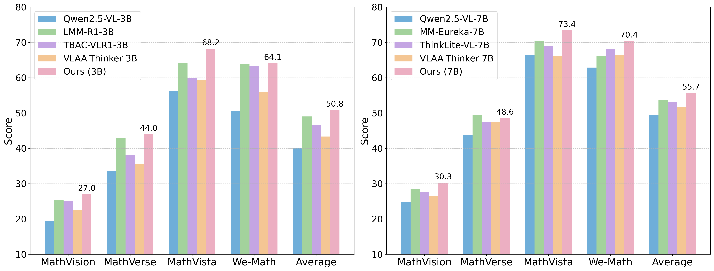

# Advancing Multimodal Reasoning via Reinforcement Learning with Cold Start


<p align="center">
⬇️ <a href="https://huggingface.co/WaltonFuture/Qwen2.5VL-7b-RL-with-Cold-Start" target="_blank">7B Model</a> | ⬇️ <a href="https://huggingface.co/WaltonFuture/Qwen2.5VL-3b-RL-with-Cold-Start" target="_blank">3B Model</a> | 📃 <a href="https://arxiv.org/pdf/2409.13191" target="_blank">Paper</a> <br>
</p>

## Introduction

We present a comprehensive study on enhancing multimodal reasoning through a two-stage approach: (1) supervised fine-tuning (SFT) as a cold start with structured chain-of-thought reasoning patterns, followed by (2) reinforcement learning via GRPO to further refine these capabilities.
Our extensive experiments show that this combined approach consistently outperforms both SFT-only and RL-only methods across challenging multimodal reasoning benchmarks. The resulting models achieve state-of-the-art performance among open-source MLLMs at both 3B and 7B scales, with our 7B model showing substantial improvements over base models (e.g., 66.3\%→73.4\% on MathVista, 62.9\%→70.4\% on We-Math) and our 3B model achieving performance competitive with several 7B models. 

<div align=center>

</div>


## Cold Start Stage


We conduct supervised fine-tuning on Qwen2.5-VL-3B and Qwen2.5-VL-7B using [ms-swift](https://github.com/modelscope/ms-swift). In this stage, please refer to this curated [dataset](https://huggingface.co/datasets/WaltonFuture/Multimodal-Cold-Start) distilled from Qwen2.5-VL-32B using rejection sampling.

### Setup


```bash
git clone https://github.com/waltonfuture/RL-with-Cold-Start.git
cd RL-with-Cold-Start/SFT
pip install -e .
```

### Prepare Data

```bash
python convert_data.py
```

### SFT

```bash
bash qwen2.5vl_sft.sh
```

The checkpoint can be found in SFT/output.

## RL Stage


We further conduct GRPO using [EasyR1](https://github.com/hiyouga/EasyR1). Please refer to this [dataset](https://huggingface.co/datasets/WaltonFuture/Multimodal-RL-Data) for the GRPO training.

### Setup


```bash
git clone https://github.com/waltonfuture/RL-with-Cold-Start.git
cd RL-with-Cold-Start/GRPO
pip install -e .
```

### GRPO Training (replace the checkpoint with the model after SFT)

```bash
bash examples/qwen2_5_vl_7b_grpo.sh
```

### Merge Checkpoint in Hugging Face Format

```bash
python3 scripts/model_merger.py --local_dir checkpoints/easyr1/qwen2_5_vl_7b_grpo/global_step_80/actor
```

## Data Access

Our two stage datasets are now available on Huggingface.

|  Stage          | Data  |
| ------------------ | ------------- |
| Cold Start  | [Multimodal-Cold-Start](https://huggingface.co/datasets/WaltonFuture/Multimodal-Cold-Start) |
| RL  | [Multimodal-RL-Data](https://huggingface.co/datasets/WaltonFuture/Multimodal-RL-Data) |

## Model Access

Our models are now available on Huggingface.

|  Backbone           | Our model   |
| ------------------ | ------------- |
| Qwen2.5-VL-7b  | [Qwen2.5VL-7b-RL-with-Cold-Start](https://huggingface.co/WaltonFuture/Qwen2.5VL-7b-RL-with-Cold-Start) |
| Qwen2.5-VL-3b  | [Qwen2.5VL-3b-RL-with-Cold-Start](https://huggingface.co/WaltonFuture/Qwen2.5VL-3b-RL-with-Cold-Start) |


## Acknowledgment

Our models are built upon the amazing [Qwen2.5-VL](https://huggingface.co/collections/Qwen/qwen25-vl-6795ffac22b334a837c0f9a5) family.
We thank [EasyR1](https://github.com/hiyouga/EasyR1) and [ms-swift](https://github.com/modelscope/ms-swift) for their training codes.

## Contact

Please contact Lai Wei (waltonfuture@sjtu.edu.cn) if needed.

## Citation
```

```